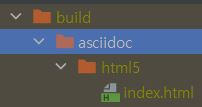
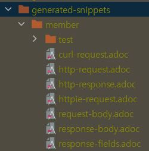

# Spring REST DOCS


Spring에는 Swagger와 같은 API 문서 작성 기능을 REST DOCS라는 이름으로 제공하고 있습니다. 

실록 서비스에서 적용한 REST DOCS 사용법에 대해 간략하게 소개할까 합니다.

일단 intellij에서 asciidoc 플러그인을 설치해 주시길 바랍니다.

본격적으로 API 문서를 작성해봅시다. 

먼저 테스트 코드를 작성합니다.

테스트 클래스에
```
@AutoConfigureRestDocs(outputDir = "build/generated-snippets")
```
위 어노테이션을 설정하여, RestDocs에 필요한 snippets이 만들어질 위치를 지정합니다.

테스트 코드를 작성해 봅시다.

```
.andDo(document("member/test", 
    responseFields(
        fieldWithPath("memberId").description("member unique id"),
        fieldWithPath("name").description("name"),
        fieldWithPath("email").description("email"),
        fieldWithPath("identifier").description("test"),
        fieldWithPath("uniqueCode").description("123")
    )
)
```
테스트 코드 검증을 `andExpect`를 통해 마쳤다면, 위와 같이 document안에 디렉토리 구조와 RestDocs로 표현할 필드를 작성합니다.

여기서 DTO에 해당하는 모든 필드를 모두 작성해야 하며, 작성하지 않을 시 에러를 던지게 됩니다.

이렇게 작성한 테스트 코드를 실행하면 



위와 같이 snippets가 만들어지게 됩니다.




이제 생겨난 snippets를 통해 <br>`build/asciidoc/html5`</br> 폴더에 html 파일을 만들고, snippets를 끌어다 사용하면 됩니다. 

최종적으로 빌드를 실행하고, 프로젝트를 실행하게 되면, localhost:8080/docs/{파일명}.html 경로를 통해 만들어진 API 문서를 확인할 수 있습니다.