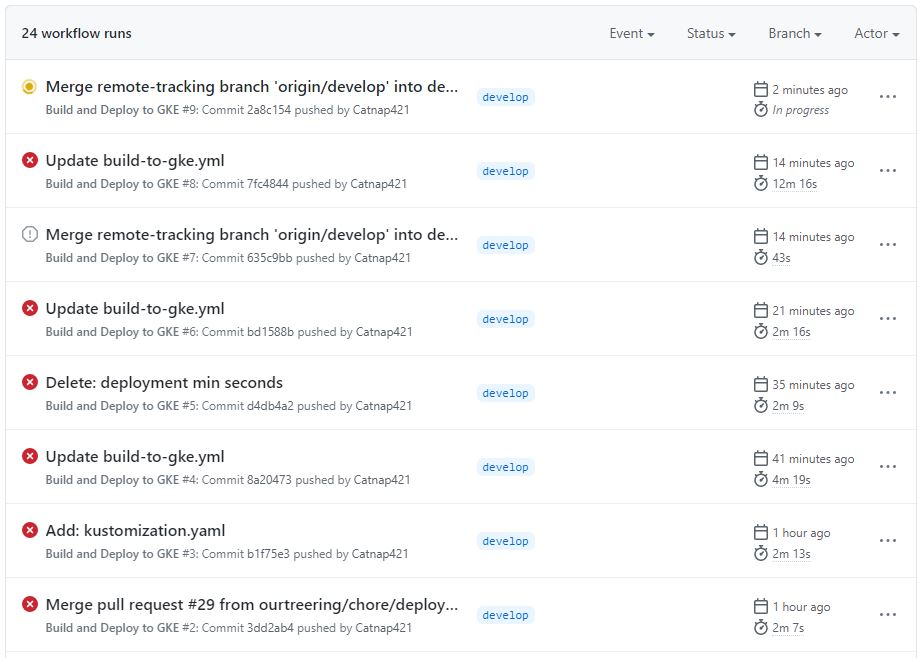

안녕하세요. 26층 개발자들의 리드 낭만개발자 조현우입니다. 오늘은 실록 서비스를 개발하는 과정 중에서 효율적인 CI/CD를 구축하기 위해 삽질한 과정을 설명드리도록 하겠습니다. 처음이라 많이 모자라니 많은 피드백 부탁드립니다.

# 배포 전략 세우기

효율적으로 어떻게 배포 전략을 세울지 고민을 해보았습니다. 그렇게 떠오르는 방안으론 두 가지가 있었습니다.

1. 젠킨스를 사용하여 배포하기
2. 떠오르는 샛별! 깃허브 액션으로 배포하기

젠킨스를 통해 배포하는 것도 좋지만, 그보다는 도커와 쿠버네티스를 활용하여 DevOps를 운영하고 싶었습니다. 그래서 CI 툴을 고민하다 요새 다양하게 활용하는 깃허브 액션을 사용해보기로 결정하게 되었습니다.

~~미리보는 삽질의 노고~~

## 배포 방법 정하기
-------------------------

깃허브 액션으로 배포를 진행하기로 했지만, 세부적으로 들어가면 또 하나 정해야할 게 존재합니다. 그건 바로 어떤 인프라를 구축하냐입니다. 클라우드 서비스를 활용하는 건 같지만, IaaS(GCP GCE, AWS EC2 등)를 사용할건지 SaaS(GCP GKE, AWS EKS 등)를 사용할건지에 따라도 달라집니다. 

각각의 장단점이 존재하지만, 저는 데브옵스 초보이기 때문에, 돈이 더 드는 SaaS를 사용하기로 결정했습니다. ~~(사장님 죄송해요)~~

## 배포 구현하기
---------------------------

그럼 본격으로 배포 인프라를 구축해봅시다.

다음과 같은 순서로 진행해보겠습니다.
1. GKE 생성
2. 깃허브 액션 작성
3. 액션과 관련된 secret 설정
4. Dockerfile 작성
5. deployment.yml, kustomization.yml 
6. 앱 노출하기

### 1. GKE 생성

GKE를 생성하는 예제는 인터넷에 다양하니 넘어가도록 하겠습니다.
중요한 건 container registry를 활성화하는 것입니다. [시작하기](https://cloud.google.com/container-registry/docs/quickstart)

구글에서 친절하게 문서를 제공하니 찬찬히 따라해보고 오세요!

### 2. 깃허브 액션 작성

이것도 사실 엄청 간단합니다. 

왜냐! 이미 구글에서 만들어서 github에 등록을 해놓았기 때문이죠.

~~못생긴 네모..~~

이미 정의된 깃허브 액션을 사용하시면 됩니다. 

~~~yml
# Set permission
- name: Grant execute permission for gradlew
  run: chmod +x gradlew
- name: Build with Gradle test
  run: ./gradlew test 
- name: Run copyDocument task
  run: ./gradlew copyDocument
- name: Build with Gradle
  run: ./gradlew build
~~~

저희 서비스 같은 경우, SpringBoot의 RestDocs를 사용하기 때문에, 위와 같은 Job을 추가로 작성했습니다. 
RestDocs를 제대로 사용하려면, Test-Docs-Build 순서대로 진행되어야 합니다. 만약 RestDocs를 사용하고 싶다면 위의 step을 추가해주시면 됩니다. (물론 하나로 합치셔도 됩니다.)

### 3. 액션과 관련된 secret 설정

깃허브 액션 내용을 살펴보면, 자세히 설명해 놓은 주석을 확인하실 수 있습니다. 주석에 맞춰, 
secret과 환경변수를 설정해주시면 됩니다. 

대부분은 쉽게 검색해서 얻을 수 있는 정보지만, 이 중에서 DEPLOYMENT_NAME 같은 경우, 추후 작성할 
deployment.yml 파일에 정의된 이름을 사용하셔야 합니다!

### 4. Dockerfile 작성

액션 내에 정의된 docker build를 사용하기 위해 Dockerfile을 Root Folder에 작성해봅시다.

~~~Dockerfile
FROM openjdk:11-jdk

ARG JAR_FILE=build/libs/*.jar
COPY ${JAR_FILE} app.jar
ENTRYPOINT ["java","-jar","/app.jar"]
~~~

정말 짧죠?? 설명하면 jar 파일로 만들어서 실행시킨다는 의미 입니다!

### 5. deployment.yml, kustomization.yml 

이제 거의 다 왔습니다. 빌드한 도커 이미지를 Google Container Registry에 올렸다면, 해당 이미지를 쿠버네티스에 적용시켜야 합니다. 그러기 위해선 `deployment.yml`, `kustomization.yaml` 두 파일을 작성해야 합니다.

~~~yml
# deployment.yml

apiVersion: apps/v1
kind: Deployment
metadata:
  name: sillock-app-deployment
spec:
  replicas: 1
  selector:
    matchLabels:
      app: sillock-app-dev
  template:
    metadata:
      labels:
        app: sillock-app-dev
    spec:
      containers:
        - name: sillock-app-dev
          image: gcr.io/PROJECT_ID/IMAGE:TAG
          resources: {}
          ports:
            - containerPort: 8080
~~~

~~~yaml
# kustomization.yaml

apiVersion: kustomize.config.k8s.io/v1beta1
kind: Kustomization

resources:
  - deployment.yml
~~~

`kustomization.yml`은 k8s의 오브젝트를 선언형식으로 관리한다고 생각하시면 됩니다.
선언형 관리에 좀 더 공부하고 싶다면, `참고 사이트4`를 참고하세요!! 

### 6. 앱 노출하기

5번까지 설정을 완료하고 깃허브 액션을 실행하게 되면 google container registry에 해당 이미지가 올라간 것을 확인하실 수 있을 것입니다. 

또한 cloud shell을 통해 `kubectl get deployments`를 입력하면 배포까지 완료된 것을 확인하실 수 있을 것입니다. 

여기까지 잘 따라오셨다면 쿠버네티스 클러스터에서 앱을 실행할 수 있는 준비가 다 된 것입니다. 최종적으로 앱을 인터넷에 노출하면 완료됩니다. 외부로 노출하기 위해선 service를 생성해야 하는데, service는 파드에 접근할 수 있도록 정책을 정의하는 것이라고 생각하면 됩니다. 참고로 만약 5번에서 `kustomization.yaml` 안에 service를 정의해 놓으셨다면, service 또한 자동으로 구성될 것입니다.

~~~s
kubectl expose deployment sillock-app-depolyment --name=sillock-app-service --type=LoadBalancer --port 80 --target-port 8080
~~~

`--type=LoadBalancer`로 입력을 해야 클라우드 공급자 쪽에서 로드 밸런서를 사용하여 서비스를 외부에 노출시킵니다. 만약 클라우드를 사용하는 게 아니라면, `--type=NodePort`로 설정해주면 됩니다. NodePort를 사용할 시, 쿠버네티스 컨트롤 플레인에서 고정포트를 통해, 외부에서 서비스로 접속을 할 수 있도록 해줍니다. 

`kubectl get service`를 통해 external Ip와 port를 통해 서비스에 접속이 가능한 것을 확인하실 수 있습니다.

## 최종 모습
---------------------------

하나하나 제대로 돌아가는 지 확인하기 위해 잘게 쪼개다 보니 이미지와 같이 엄청난 step을 수행하게 되었습니다..😂

(웹 상에서 확인 가능한 Rest API 문서)

그래도 성공한 모습을 보니 뿌듯합니다. 

이렇게 실록 서비스를 담당할 CI/CD 환경을 구축해 보았습니다. 

아직은 고칠 것도 많고(예를 들면, 캐시를 사용한 배포 속도 개선?), 맘에 들지 않는 모습도 많이 보이지만, 하나하나 개선해 나가는 모습 보여드리겠습니다!

### 아키텍처 최종 모습

## 참고 사이트

-----------------------------

[참고 사이트1](https://devopswithkubernetes.com/part-3/2-deployment-pipeline)

[참고 사이트2](https://kubernetes.io/ko/docs/concepts/workloads/controllers/deployment/)

[참고 사이트3](https://cloud.google.com/kubernetes-engine/docs/tutorials/hello-app)

[참고 사이트4](https://kubernetes.io/ko/docs/tasks/manage-kubernetes-objects/kustomization/)