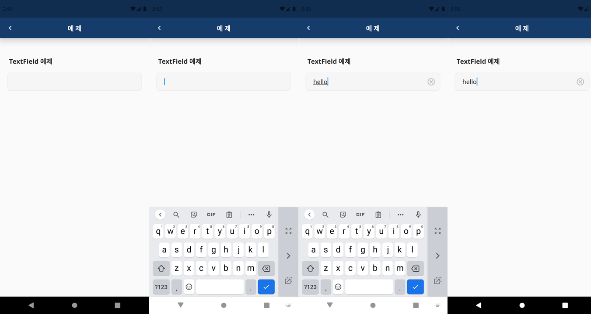

안녕하세요. 26층 개발자들에서 앱 프론트엔드를 맡고 있는 D드림입니다!

이번 포스팅에서는 커서 인식 및 글 자동 삭제 기능을 가진 `Textfield` 위젯 예제를 소개해드리도록 하겠습니다.

<br><br><br><br>

## **TextField**
---

살펴볼 예제의 `TextField`  코드입니다.<br><br>

```dart
Container(
    decoration: BoxDecoration(
        color: Color(0xFFF6F6F6),
        border: Border.all(
          color: Color(0xFFE8E8E8),
        ),
        borderRadius: BorderRadius.only(
            bottomRight: Radius.circular(10.0),
            bottomLeft: Radius.circular(10.0),
            topLeft: Radius.circular(10.0),
            topRight: Radius.circular(10.0))),
    child: Padding(
      padding: const EdgeInsets.only(left: 20.0),
      child: TextField(
        controller: _textController,
        decoration: InputDecoration(
          border: InputBorder.none,
          focusedBorder: InputBorder.none,
          suffixIcon: _textController.text.length > 0
              ? IconButton(
                  icon: Icon(Icons.cancel_outlined,
                      color: Color(0xFFBCBCBC)),
                  onPressed: () {
                    _textController.clear();
                  },
                )
              : null,
        ),
      ),
    ))
```

해당 예제에서는 Container의 `decration` 파라미터에 있는 `BoxDecoration`을 사용하여 `TextField` 위젯의 색상 및 border 처리를 해주었습니다.<br><br>

## **InputDecoration**
---

`InputDecoration`을 사용하면 `Textfield` 위젯을 다양하게 디자인할 수 있습니다.<br><br>

```dart
border: InputBorder.none,
focusedBorder: InputBorder.none,
```

`border`및 `focusBorder` 속성을 통해  `TextField` 의 밑줄을 제거할 수 있습니다.<br><br>


```dart
suffixIcon: _textController.text.length > 0
              ? IconButton(
                  icon: Icon(Icons.cancel_outlined,
                      color: Color(0xFFBCBCBC)),
                  onPressed: () {
                    _textController.clear();
                  },
                )
              : null,
        ),
```

`suffixIcon` 을 통해 `TextField` 안에 아이콘을 추가할 수 있습니다.<br><br>

다음 코드에서는 간단한 조건문을 통해 `TextField` 안에 text가 있는 경우 아이콘이 활성화 되도록 하였으며, 해당 아이콘을 누를 시에는 text가 삭제되도록 하였습니다.<br><br>

## **TextEditingController**
---

`TextEditingController` 를 사용하면 특정 이벤트가 발생하였을 때, `TextField` 의 현재 입력된 값에 접근할 수 있습니다.<br><br>

```dart
TextEditingController _textController = TextEditingController();
```

다음과 같이 class 안에 `TextEditingController` 을 `_textController` 로 선언한 후,<br><br>

```
_textController.addListener(() {
      setState(() {});
    });
```

`_textController` 의 리스너를 추가합니다.<br><br>

```dart
controller: _textController,
```

`TextField` 의 controller 파라미터에 `_textController` 를 설정합니다.<br><br>

## **GestureDetector**
---

 `TextField` 가 Focus 상태일 때 키보드가 활성화 되고, 키보드의 Done 키를 누르면 `Textfield` 가 unFocus 상태가 되며 키보드가 사라집니다.<br><br>

이 때 사용자의 이벤트를 감지하는 `GestureDetector` 위젯을 이용하면 `TextField` 이외의 다른 화면 클릭 시 활성화 된 키보드를 사라지게 할 수 있습니다.

```dart
body: GestureDetector(
  onTap: () => FocusScope.of(context).unfocus(),
  child: SingleChildScrollView(...))
```

다음과 같이 `TextField` 를 감싸고 있는 위젯을 `GestureDetector` 위젯으로 한 번 더 감싸줍니다.

화면을 클릭하였을 때, 키보드의 Focus를 제거하기 위해 `FocusScope` 위젯의 `unfocus` 함수를 사용합니다.<br><br>

## **전체코드**
---

```dart
import 'package:flutter/material.dart';

class Example extends StatefulWidget {
  @override
  _ExampleState createState() => _ExampleState();
}

class _ExampleState extends State<Example> {
  TextEditingController _textController = TextEditingController();

  @override
  Widget build(BuildContext context) {
    _textController.addListener(() {
      setState(() {});
    });

    return Scaffold(
        appBar: AppBar(
          title: const Text('예 제', style: TextStyle(color: Colors.white)),
          backgroundColor: Color(0xFF163C6B),
          leading: IconButton(
              onPressed: () {
                Navigator.pop(context); //뒤로가기
              },
              color: Colors.white,
              icon: Icon(Icons.navigate_before)),
        ),
        body: GestureDetector(
          onTap: () => FocusScope.of(context).unfocus(),
          child: SingleChildScrollView(
            child: Column(
              crossAxisAlignment: CrossAxisAlignment.start,
              children: [
                Padding(
                  padding: const EdgeInsets.only(top: 50.0, left: 25.0),
                  child: Text("TextField 예제",
                      style:
                          TextStyle(fontSize: 18, fontWeight: FontWeight.bold)),
                ),
                Padding(
                  padding: const EdgeInsets.all(20),
                  child: Container(
                      decoration: BoxDecoration(
                          color: Color(0xFFF6F6F6),
                          border: Border.all(
                            color: Color(0xFFE8E8E8),
                          ),
                          borderRadius: BorderRadius.only(
                              bottomRight: Radius.circular(10.0),
                              bottomLeft: Radius.circular(10.0),
                              topLeft: Radius.circular(10.0),
                              topRight: Radius.circular(10.0))),
                      child: Padding(
                        padding: const EdgeInsets.only(left: 20.0),
                        child: TextField(
                          controller: _textController,
                          decoration: InputDecoration(
                            border: InputBorder.none,
                            focusedBorder: InputBorder.none,
                            suffixIcon: _textController.text.length > 0
                                ? IconButton(
                                    icon: Icon(Icons.cancel_outlined,
                                        color: Color(0xFFBCBCBC)),
                                    onPressed: () {
                                      _textController.clear();
                                    },
                                  )
                                : null,
                          ),
                        ),
                      )),
                ),
              ],
            ),
          ),
        ));
  }
}

```


이번 예제의 전체코드를 올려드립니다!

이번 포스팅이 플러터 개발에 조금이나마 도움이 되었으면 좋겠습니다 :D