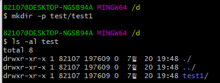

# 10시간의 에러 해결 경험

지난 월요일, 저는 끔찍한 경험을 했습니다. 무려, 하나의 에러를 10시간 동안 붙잡으면서 끙끙 앓다가 해결하는 경험을 했어요. 이 끔찍한 경험 속에서 그래도 얻은 게 있기에 이렇게 글로 작성해서 공유할까 해요!

 

## 상황 설명

1. REST DOCS를 만들기 위해 컨트롤러 테스트를 작성
2. 로컬 환경에선 실패하지 않는 테스트가 github action으로는 계속 테스트가 실패
3. 실패 지점은 `andDo(Document(..))`이지만, 정확한 로그가 안 찍혀서 에러 원인은 모르는 상황

 

## 문제 해결

   

제가 얼마나 많은 시도를 했는 지를 확인할 수 있어요. 

저렇게 많이 시도한 이유는 깃허브 액션에서 자세한 로그를 확인할 수가 없었고, 에러의 원인이라고 생각되는 게 검색해도 나오지 않아서 사소한 거 하나하나 테스트를 해볼 수 밖에 없었어요.

  

결국 깃허브 액션 로그를 볼 수 있는 다양한 방법을 찾다, 위와 같은 액션을 발견할 수 있었습니다. 해당 액션을 사용하면, 정말 자세하게 에러를 볼 수 있습니다.

   

이렇게 실패하게 되면, 해당 액션에 이미지와 같이 알림 메시지를 만들어서 보여줍니다.

   

자세하게 살펴보니, 확실하게 에러 로깅이 된 것을 확인할 수 있습니다. 로그 확인 결과, 디렉토리 만드는 것을 실패했단 걸 알 수 있습니다.

여기서 코드를 확인해보니 `Document("/api/..")`처럼 코드가 작성되어 있었고, 맨 앞에 슬래시를 없애니 정상적으로 코드가 동작했습니다.

 

## 정확한 원인 분석

너무나도 끔찍한 경험을 했기에 한 번 제대로 원인을 분석해보고 싶었습니다.

RestDocs 깃허브에 가서 관련 에러로 검색을 해보았습니다.

  

  

  

  

  

밑에서부터 최상단 코드까지 살펴보았긴 하지만, 가장 중요한 건 마지막 이미지에 담긴 코드입니다.

IllegalStateException을 던지기 위해선, 주어진 parent 변수가 디렉토리가 아니거나, 디렉토리를 만들 수 없어야 합니다.

`File` 관련 공식 API를 살펴보니, `mkdirs()`가 에러의 원인인 것을 알 수 있었습니다.

곰곰히 생각해 본 결과, JVM을 사용한다고는 하지만, 결국엔 운영체제의 명령어를 호출하는 것일테고, 그렇다면 각각의 운영체제 명령어에 근본적인 원인이 있지 않을까 생각해 보았습니다.

검색을 해보니 `File의 mkdirs()` 메서드는 리눅스의 `mkdir --parents`를 호출하며, 윈도우의 `md` 명령어를 호출한단 사실을 알 수 있었습니다. 

그래서 실제로 명령어를 사용해보았습니다.

### 리눅스
  

  

리눅스에선 맨 앞에 슬래시가 있을 경우, 에러를 던지는 것을 확인할 수 있습니다.

### 윈도우

  

  

윈도우에선 맨 앞에 슬래시가 있더라고 에러를 던지지 않습니다.

 

## 결론

10시간의 삽질은 정말 힘들고, 짜증을 유발하는 일이었습니다. 하지만 그렇기에 이렇게까지 끈질기게 에러를 분석한 경험은 처음이었고, 에러를 대하는 자세에 대해 생각해 볼 수 있었습니다. 이 경험은 절대 잊지 않을 것 같습니다.

 

### 레퍼런스

[JAVA 7 API](https://docs.oracle.com/javase/7/docs/api/java/io/File.html)

[stackoverflow](https://stackoverflow.com/questions/12202766/file-mkdir-or-mkdirs-return-false-reason)