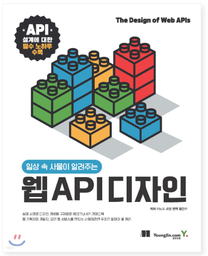

최근 API 설계를 하면서 좀 더 나은 형태로 만들 수 없을까 고민하던 중 이 책을 발견했습니다.

바로 "일상 속 사물이 알려주는 웹 API 디자인" 이라는 책입니다.

## 일상 속 사물이 알려주는 웹 API 디자인

### 개요

이 책은 실제 사례로 디자인 개념을 구체화한 RESTful API 가이드북입니다. 
크게 1부, API 디자인 기초 / 2부, 사용하기 좋은 API 디자인 / 3부, 상황에 맞는 API 디자인으로 구정되어 있습니다. 
 혹시 목차에 대해 더 알고 싶은 분은 해당 링크를 참고해주세요. 
[책 보러가기 클릭](http://www.yes24.com/Product/Goods/94462254, "책 보러가기")   

앞으로 차근차근 읽어가며 공유하면 좋을 것 같은 내용들을 포스팅할게요:) 

   

### API 디자인이 중요한 이유

API는 일반적으로 소프트웨어를 위한 것입니다. 그리고 소프트웨어를 만들고 사용하는 주체는 바록 개발자, 즉 '사람'입니다.

API 설계의 핵심은 바로 
_개발자 경험 (DX. Developer experience)_
입니다.😉

서로 다른 팀, 회사, 소속에 있는 개발자들이 이해할 수 있도록 작성해야만 합니다. 

이를 위해 다음과 같은 질문을 던져보는 것이 좋습니다.

- 사용자는 무엇을 할 수 있는가?
- 그들은 그걸 어떻게 하는가?
- 입력에 대한 질문 : 그것을 하기 위해 무엇이 필요한가?
- 출력에 대한 질문 : 그들은 무엇을 반환받는가?

  

### API 목표캔버스

API의 포괄적이고 정확한 목표를 식별하기 위해 우리는 위와 같은 질문을 던져보았어요.

그리고 이런 과정을 조금 더 쉽게 도와줄 수 있는 도구가 있습니다.  
바로 _"API 목표 캔버스"_ 입니다.

 

| 누가 |무엇을|어떻게|입력(원천)|출력(사용처)|목표|
|:------:|:---:|:---:|:------:|:---:|:---:|
|누가 사용자인가|그들은 무엇을  할 수 있는가|그들이 그걸  어떻게 하는가|무엇이 필요한가|그들은 무엇을  반환받는가|재구성된  어떻게+입력+출력|

  
- 누가 : API를 사용하는 사용자들(또는 프로파일들)을 나열
- 무엇을 : API로 사용자들이 할 수 있는 것을 나열
- 어떻게 : 무엇을 단계별로 분해해 나열
- 입력(원천) : 각 단계를 진행하기 위해 필요한 요소들과 그것들의 원천을 나열 (누락된 누가, 무엇을, 또는 어떻게를 찾기 위함)
- 출력(사용처) : 각 단계의 반환과 그 쓰임새를 나열 (누락된 누가, 무엇을, 또는 어떻게를 찾기 위함)
- 목표 : 명시적이고 간결하게 각각의 어떻게 + 입력+ 출력을 재구성

## 예시

다음과 같은 내용을 실제 프로젝트를 하며 어떻게 적용해보았는지 적어보겠습니다.😄

### 트리링이 해야할 것
구현목표 : 태그 리스트를 가져오는 엔드포인트 API 구현
- 실록 작성할 때를 위해,디폴트 태그 리스트를 프론트로 전달할 수 있는 엔드포인트를 작성해야 함

 

이를 API 목표 캔버스로 바꾸어보면 다음과 같이 나타낼 수 있겠네요!

|누가|무엇을|어떻게|입력 (원천)|출력 (사용처)|목표|
|:------:|:---:|:---:|:------:|:---:|:---:|
|실록유저|실록에 있는  태그리스트를 본다.|실록 태그등록  뷰에 들어온다.|실록 태그등록에  들어오면 자동으로 |실록 태그등록  뷰에 분류대로|실록 태그등록페이지에서  디폴트 태그들을  모두 출력해준다.|

이런 식으로 말이죠!

  
오늘은 API 디자인의 필요성부터 살펴보았어요. 

디자인을 하기전, 왜 필요한지 알아야 더욱 효율적으로 짤 수 있을테니까요ㅎㅎ

계속 읽으면서 같이 공유하면 좋을 것 같은 내용들로 찾아올게요! 
다음 포스팅에서 봐요😄

