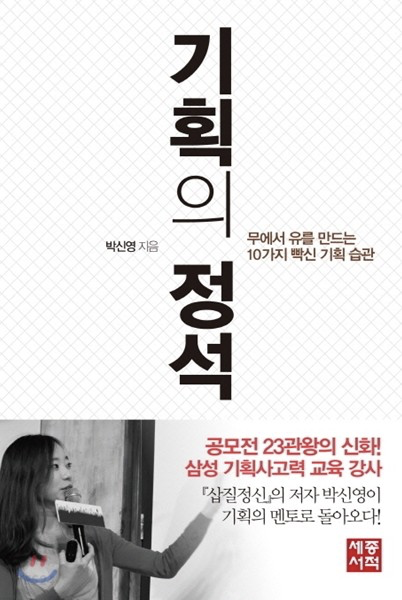

기가막힌 아이디어가 있고, 팀원도 모았습니다.  
이제 아이디어를 발전시켜 기획을 고도화하고, 개발도 진행하고, 테스트 단계를 거쳐서, 런칭을 진행할 일만 남았습니다.

물론 그동안 벤쳐 동아리 경험이 있으시거나, 체계적인 교육을 통해서 조직을 경험해 보신 분이라면 어떤 부분을 공부해야할지 명확하게 아실 것입니다.  
하지만 소규모 팀프로젝트가 전부셨다면 이런 고민을 하실 것입니다

*"분명 토이 프로젝트보다는 좋은 결과물을 내고 싶은데, 어떻게 하면 완성도를 높일수 있을까?"*

---
🔎 **GOOGLE** : ㄱ..ㅣ..획..잘..하..느..ㄴ..법

---

우리는 뭘 모르는지 모르겠는데, 어떤 검색을 해야할까요..🧐 *(물론 구글에는 모든 것이 있겠지만..)*

중심이 없는 상태에서 파편화된 정보들은 오히려 독이 된다는 것을 이번에 많이 느꼈습니다.  
원래 한권만 읽은 사람이 무섭다고, 어떤 점을 수용해야하고 어떤 점은 참고만 할지 판단해야하는데, 다 맞는 것 같아서 고민이 되기 때문이죠.  
한달정도 기존의 방식을 고집하며 잦은 피봇팅을 진행 한 후, 처음부터 체계를 잡아야겠다고 다짐했습니다

제가 선택한 방법은 책 읽기였습니다.

물론 좋은 강의도 많고, 블로그 포스팅도 많지만, 책이 원하는 정보만을 빠르게 읽을 수 있으면서도 제일 체계적이라고 판단했습니다.

특히 주변에 기술 관련 서적 작가님들이 많은 돈이 되지 않는 것을 아시면서도 책을 쓰시는 것을 볼 때마다 더더욱 확신합니다.  
한장 쓰는데도 시간이 오래걸리기 때문에 힘들다고 하시면서도 누구보다도 사명감으로 일하시기 때문입니다.  

이번 포스팅에서는 기획 초기 단계에서 도움을 많이 받았던 책들을 공유하고자 합니다.  
물론 모든 책이 다 정답이 아니라는 것은 항상 명심해야 합니다.😃

---
### 1. 기획의 정석

*" 전략/기획, 제안서 작성, 설득을 위한 기초 프로세스 집대성 "*  
*“ 기획을 잘하는 사수가 필요하다면 “*  

{: width="200" height="300"}  

책 뒷편 후기중 “90분 만에 훔칠 수 있다. 그녀의 탁월한 기획력을!” 이라는 말이 제일 와닿습니다.  
기획서를 더 잘쓰는 것 뿐 아니라, 전반적으로 생각하는 방법을 바꿀 수 있기에 첫번째로 꼽았습니다.  
단순히 기획을 떠나서 아이디어를 구체화하거나 검증할 때도 활용할 수 있고, 논리적으로 상대방에게 말해야하는 상황, 의견을 공유하는 등의 대화에서도 적용할 수 있는 기술들이 많습니다.

기회가 된다면 한번 꼭 읽어보세요 😃  

[네이버 책 구매 링크](https://book.naver.com/bookdb/book_detail.nhn?bid=7193378)

---
### 2. 현업 기획자 도그냥이 알려주는 서비스 기획 스쿨

*" 모바일 서비스 기획 A-Z, 전반적인 프로세스를 알고 싶다면 "*  

{: width="200" height="300"}  

책의 부제목이, '사수 없이 시작하는 웹/앱 프로덕트 실전 입문서'일 만큼 사수가 없는 저에게는 사수가 되어준 책입니다.  
처음 단계에서부터 마지막 단계까지 마치 강의를 듣는 것처럼 잘 정리되어 있으며, 앱 기획 전반에 대해서 우리가 무엇이 부족하고 모르는지에 대해서 명확하게 알려줍니다.  
기획 전반을 다루면서도, 중간중간에 실무 관련 경험도 엿볼 수 있어 입문책으로 훌륭합니다.  

이해가 안가는 부분은 중간에 QR코드로 강의도 연계 되어있고, 작가님의 다양한 글, 강의 영상들도 참고하실 수 있습니다

[도그냥의 브런치](https://brunch.co.kr/@windydog)  
[네이버 책 구매 링크](https://book.naver.com/bookdb/book_detail.nhn?bid=16378491)

---
### 3. 스프린트

*" 린 스타트업, 초기 모델 검증에 대해서 알고 싶다면 "*  
*" 빠르게 아이디어 고도화부터 프로토타입까지 진행해보고 싶다면 "*  
*" 개개인의 생각을 최대한으로 끌어오면서, 빠르게 의견을 조율하고 결정하는 법을 알고싶다면 "*  

{: width="200" height="300"}

린 스타트업, 많이 이야기를 들어보셨을 것이지만 문제 도출부터 프로토타입까지 일주일안에 만드는 것이 과연 가능할까 라는 생각을 했었습니다.  
이 책은 구글 벤쳐스에서 5일 동안 프로토타입 까지 만들어 초기 시장 반응을 확인하는 과정을 보여주고 있습니다.  

물론 모든 것을 그대로 도입하는 것에는 스타트업이기에 인원적, 자원적, 문화적으로도 한계가 있을 것입니다.  
하지만 프로토타입이 나오기 까지 수많은 결정을 내리는 법과 의견들을 조율하는 과정, 또 개개인의 아이디어를 극대화 하는 방법을 보여주는데, 이런 기술들은 바로 응용하여 활용하기에 너무 유용합니다.  

[네이버 책 구매 링크](https://book.naver.com/bookdb/book_detail.nhn?bid=11124734)

---
### 4. 트렌드 코리아 2020, 트렌드 코리아 2021
*" 트렌드를 짧은 시간내에 알고 싶다면 "*  
*" 사업 아이디어에 트렌드를 추가하고 싶다면 "*

{: width="200" height="300"}

만약 리디북스와 같이 구독형 서비스를 이용하고 계시다면, 일단 다운 받고 목차를 보세요 😃  
목차만 봐도 트렌드를 어느정도 알 수 있고, 해당 주제에 대해서 체계적으로 알 수 있습니다.  
처음 아이디어를 낼 때도 도움을 줄 것이고, 기존의 서비스에 날개를 달아줄 레퍼런스를 얻을 수 있습니다.  

[네이버 책 구매 링크](https://book.naver.com/bookdb/book_detail.nhn?bid=16743757)

---
### 5. UX/UI의 10가지 심리학 법칙
*" 왜인지 모르겠지만 마음에 안드는 UI/UX, 이유를 알고 싶다면 "*

{: width="200" height="300"}

UI/UX에 대한 10가지 심리학 법칙에 대해서 정리했으며, 양이 많지 않아 부담없이 읽기 좋습니다.  
뛰어난 디자이너가 있으면 다 해결해 주겠지만, 가끔씩은 결과물을 보면서 뭔가 UI/UX가 이상한 것 같고, 불편하다는 느낌이 들 때가 있습니다.  
이럴때 ‘그냥 뭔가 이상해’라고 말하는 것은 말하면서도 찝찝합니다.  
이 상황에서 가려운 곳을 한권의 책으로도 긁어줄 수 있을 것입니다.   

[네이버 책 구매 링크](https://book.naver.com/bookdb/book_detail.nhn?bid=16682913)

---
### 마치며

이렇게 창업 초반 도움을 많이 받았던 멘토와 같은 책들이었습니다.  

앞으로 더 좋은 책이 있다면 계속해서 업데이트 하도록 하겠습니다. 😃
