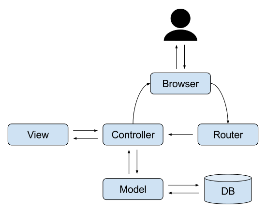
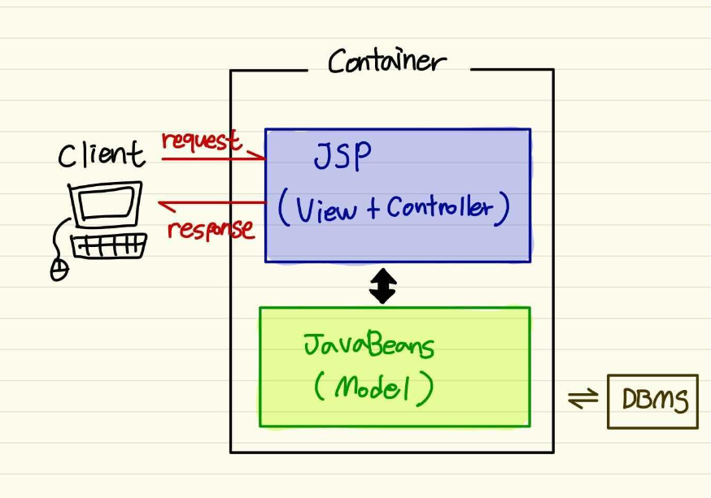
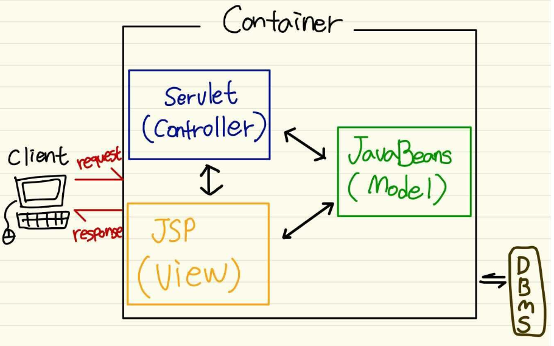

# 어디선가 많이 들어본 그 단어 MVC
개발을 하다보면 한번쯤 듣게 되는 그 단어! "MVC" 
모델, 뷰, 컨트롤러까지는 들어봤는데 그래서 이 친구들이 무슨 관계를 가졌길래 짝꿍들처럼 매번 등장하는 걸까요?

*"여기서도 MVC로 설계, 저기서도 MVC로 설계.. MVC는 어떻게 나온거지? "*

## 용어 정리부터 하고가자!

설명전에 간단히 용어를 알고가면 MVC는  Model / View  / Controller 의 약자입니다.

---
🌸 Model : 데이터, 데이터를 처리하는 영역

🌸 View  : 화면 디자인, 결과를 출력하는 영역.

🌸 Controller : 웹의 요청들(request,response)을 처리하는 영역. View와 Model이 소통하는 중간통신 매개체 역할이라고 할 수 있어요.

---

## 웹 애플리케이션에서 MVC의 일반적인 형태
여러분이 일반적으로 보았을 MVC 형태 하면 다음과 같은 아키텍쳐가 떠오를거예요.

  

처음부터 MVC가 이런 형태로 짠! 하고 만들어졌을까요? *(에이 설마..)*  

당연히 처음부터 만들어졌을리 없죠😃
그럼 어떤 모습들을 거쳐서 지금의 모습이 되었는지, 그리고 현재의 모습을 만들어주기 위해 어떤 도구들이 등장했는지 알아볼까요?

---
# JSP의 Model 1, Model 2 아키텍쳐

Spring하면 빠질 수 없는 JSP!
간단히 JSP에 대해 알아보면 다음과 같아요! 

🌸 JSP(Java Server Pages) 
- Java 언어를 기반으로 하는 Server Side 스크립트 언어 
- JSP의 가장 큰 특징은 HTML코드에 JAVA 코드를 함께 넣어 동적인 웹페이지를 만들 수 있게 도와준다는 것이에요.
- JSP를 통해서 정적요소인 HTML과 동적으로 생성되는 contents(HTTP 요청 파라미터)가 함께 사용될 수 있어요.
 
  ​
 
  JSP문서는 이후 Servlet 클래스로 자동 변환되어 동적인 기능들을 수행하게 된다는 특징이 있어요!
  
 
그렇다면 왜 MVC를 설명하는데 JSP가 나왔냐!

MVC 아키텍쳐인 Model 1과 Model 2를 설명하는데 빼놓을 수 없기 때문이죠 😃

​
# Model 1 아키텍쳐

### 특징 
### View + Controller

- JSP 파일에서 Controller 기능과 View 기능을 모두 처리한다는 특징이 있어요. 
때문에 모델을 뷰와 컨트롤러에서 한번에 처리한답니다!

- 90년대 말에서 00년대 초까지 자바기반의 웹 어플리케이션 개발에 사용되었다고 해요 😉 *"오~ 꽤 오래되었는걸요?"*

{: width="550"}

- JavaBeans는 데이터베이스 연동에 사용되는 자바 객체들이에요.
(자바에서 Bean이라는 용어는 객체를 의미한답니다.)
  
- 원래 Model 의 정확한 의미는 데이터베이스 연동로직을 제공하면서 DB에서 검색한 데이터가 저장되는 자바 객체라고 할 수 있어요. 
스프링에서는 VO(DTO), DAO 클래스가 바로 Model 기능의 자바 객체라고 할 수 있는 거죠!

​

Model 1은 개발속도가 빠르다는 장점이 있어요.

​

### 하지만 단점! 😡

1) JSP 파일에 자바코드와 마크업 관련 코드들이 뒤섞여 있어 역할구분이 명확하지 않다

2) 자바로직과 화면디자인이 통합되어 개발자와 디자이너 서로 힘들다.
   (프론트엔드 백엔드 둘다 지옥)

3) JSP 파일에 대한 디버깅과 유지보수에 많은 어려움이 생긴다.

​

따라서 Model1 구조는 적은 개발인력으로 간단한 프로젝트를 수행하는 때라면 사용할 수 있지만,

엔터프라이즈 급의 복잡한 시스템에는 복잡한 모델인 셈이죠 😃

---

​
# Model 2 아키텍쳐

### 특징
### Model / View  / Controller

그래서 Model 2 아키텍쳐가 나왔어요!

일반적으로 Model 2를 MVC라 부르고있어요.

​

Model 2에서는 기존 JSP가 담당했었던 Controller 로직이 --> 별도의 서블릿으로 옮겨졌어요.

​

{: width="550"}

​
즉 Model 1 의 JSP 파일에서 자바코드들만 Controller 역할의 서블릿으로 이동하면 Model 2 아키텍쳐!
  아까와는 다르게 프론트와 백엔드가 나뉘어져 있어 유지보수가 훨씬 용이합니다!

하지만 이와같은 방법도 하나의 서블릿으로 컨트롤러를 구현하면 클라이언트의 모든 요청을 하나의 서블릿이 처리하게 된다는 약점이 있었어요.

​

따라서 수많은 분기처리로직을 가지고 --> 이는 개발의 유지보수를 어렵게 한다는 문제가 발생했죠.🤣

​

결국 Controller를 서블릿 클래스 하나로 구현하는 것은 여러 측면에서 문제가 있어 다양한 디자인 패턴을 결합해 개발과 유지보수의 편의성을 고려하기 힘들다는 이야기가 나오기 시작했어요!

# MVC 프레임워크
그래서 또 나온것이 Spring MVC나 Struts 같은 MVC 프레임워크에요!

다 스토리가 있죠? 😃

​

최종적으로 사용할 Spring MVC는 DispatcherServlet을 시작으로 다양한 객체들이 상호작용하며 클라이언트의 요청을 처리하는 방식이에요ㅎㅎ

​

(DispatcherServlet 는 Frontend Contllor 패턴을 사용해요. 자세히 보고싶으면 여기로! => 
[Dispatcher-Servlet 이란?](https://mangkyu.tistory.com/18)  ) 

​

스프링 프레임워크에서는 이 DispatcherServlet 클래스의 역할을 하는 클래스를 제공하는 거지요!

​

그리고 다음과 같은 역할을 해줍니다.

1) Url을 분석해 적절한 컨트롤러를 찾아줌

2) 컨트롤러에서 필요한 메소드를 불러줌

3) 컨트롤러의 결과 데이터를 뷰로 전달해줌

4) 적절한 뷰를 찾아줌

​

​

스프링이 없다면 DispatcherServlet 클래스와 상호작용할 HandlerMapping, Controller, ViewResolver 객체들을 하나하나 만들어줘야 하지만
 이제는  스프링 컨테이너에서 생성해줘요😳 너무 편리하지 않나요?

​

한마디로 DispatcherServlet 은 클라이언트의 요청 처리에 필요한 HandlerMapping, Controller, ViewResolver 객체들을
  생성하기 위해 스프링 컨테이너를 구동하는 것이였죠.

​
이렇게 해서 다시 처음에 봤던 일반적인 형태가 된 거예요😆

  

---

## 마무리

지금까지 MVC의 스토리에 대해서 알아보았어요. 
모델, 뷰, 컨트롤러가 무엇이고, 어떤 과정을 통해 지금의 모습이 되었는지 Model 1과 Model 2를 통해 더 쏙쏙 이해가 되었어요! 
지금까지 막연히 구분을 해왔었다면 지금부턴 어떤 필요를 가지고 구분을 해 활용하면 좋을지 생각해보는건 어떨까요? 
우리에겐 MVC 구현을 도와줄 Spring도 있다구요ㅎㅎ 

그럼 다음번에 만나요!😉

​

---
### 참고 레퍼런스
[Dispatcher-Servlet 설정](https://mangkyu.tistory.com/13)  
[Dispatcher-Servlet 이란?](https://mangkyu.tistory.com/18)  
[모델1,2방식의 장단점과 스프링 mvc](https://m.blog.naver.com/jydev/221173318357)  
[스프링퀵스타트](http://www.kyobobook.co.kr/product/detailViewKor.laf?mallGb=KOR&ejkGb=KOR&barcode=9791186710074)  